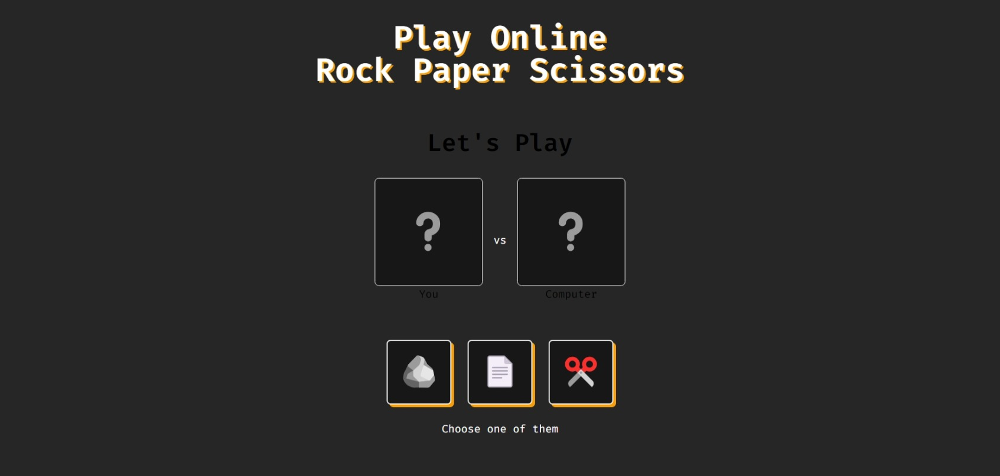

# Rock-Paper-Scissors



## Description

Rock-Paper-Scissors is a classic hand game that is played between two people. Each player simultaneously forms one of three shapes with an outstretched hand. The possible shapes are rock, paper, and scissors. The game has simple rules and is often used as a fair choosing method.

## Features

- Play against the computer
- Randomized computer selection
- Result display (win, lose, draw)
- Responsive design

## Technologies Used

- HTML
- CSS (Tailwind CSS)
- JavaScript

## How to Run the Project

1. Clone the repository:
   ```bash
   git clone https://github.com/AnshumanAtrey/rock-paper-scissors
   ```
2. Navigate to the project directory:
   ```bash
   cd rock-paper-scissors
   ```
3. Open `index.html` in your web browser.

## Live Demo

You can play the game live at [https://rock-paper-scissors-atrey.netlify.app/](https://rock-paper-scissors-atrey.netlify.app/)

## Contributing

If you would like to contribute to this project, please fork the repository and submit a pull request.

## License

This project is licensed under the MIT License - see the [LICENSE](LICENSE) file for details.
